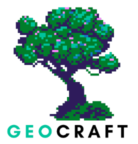

#  GeoCraft

GeoCraft es un lenguaje que permite simplificar y automatizar el proceso de creación de terrenos 3D en Unity.

<br />
<div align="center">
    
    <br>
    <em>Logo de GeoCraft</em>
</div>
<br />

El objetivo de este proyecto es desarrollar una herramienta que utilice este lenguaje para complementar el trabajo de diseñadores en la creación de terrenos de manera procedural en Unity. 

La utilidad de esta herramienta radica en su capacidad para facilitar la generación inicial de entornos y modelos que pueden ser tomados como base sobre la cual trabajar.

## 📚 Fundamentos
Este lenguaje está basado en el modelo de trabajo de Unity y en la generación procedural de terrenos (como en el videojuego **Minecraft**, basado en **chunks**).

<br />
<div align="center">
    
</div>
<br />

### ⚡¿Qué es la generación procedural?
Técnica utilizada en gráficos por computador y videojuegos para crear escenas de manera automática, sin necesidad de diseñarlos manualmente, en base a unas directrices.
<br><br>
### 🧩¿Qué es un chunk?
Se refiere a una porción o bloque de datos que se maneja como una sola unidad. En el contexto de la generación de terrenos, un chunk es una sección del mundo virtual que se carga y se procesa de manera independiente.
<br><br>

### 🛠️ Metodología de Trabajo
El objetivo del proyecto es generar terrenos 3D en Unity de manera sencilla usando nuestro lenguaje. Nos basaremos en el concepto de chunks, que son secciones o "trozos" del terreno que se pueden manejar de manera individual.

El proyecto estará dividido en escenas y cada una representará un modelo 3D diferente y estará compuesta por múltiples chunks, lo que permite una organización modular.

La idea es que cada chunk puede ser trabajado de forma independiente, lo que significa que se pueden modificar sus características, como el tamaño, la forma, la textura y otros atributos sin afectar a los demás. Esta modularidad permite a los desarrolladores personalizar y ajustar cada parte del terreno según las necesidades específicas del proyecto.

El lenguaje también permitirá la generación de objetos prefabricados, como árboles y vegetación, dentro de cada chunk. 
<br><br>

### 📊 Organización del proyecto
La idea del proyecto consiste en tomar un código escrito en nuestro lenguaje específico y pasarlo a través de un procesador de lenguaje diseñado para este fin. Al ejecutar este proceso, se generará una carpeta que contendrá subcarpetas para cada escena definida en el código. Cada una de estas escenas se traducirá en un archivo de código con la extensión .cs, el cual, al ser ejecutado en Unity, creará automáticamente la escena correspondiente en el entorno 3D.


<br />
<div align="center">
    
</div>
<br />

# 📝 Descripción del Lenguaje
A continuación, se enumeran y explican los componentes del lenguaje.

## 📚 Tipos de datos
En GeoCraft, los tipos de datos son fundamentales para la manipulación y el almacenamiento de la información. Los tipos de datos que se utilizan en este lenguaje son los siguientes:

### 🔢 INT
El tipo `INT` se utiliza para representar números enteros, tanto positivos como negativos. Este tipo es esencial para realizar operaciones artiméticas básicas, como suma, resta, multiplicación y división.

**Características**
- **Rango:** Puede almacenar valores comprendidos en el rango de  *-2,147,483,648* a *2,147,483,647*.
- **Operaciones:** Soporta operaciones aritméticas básicas.

**Ejemplo**
```
INT a = 3
INT b = 2
INT c = a + b  // Resultado: 5
```

### 📏 FLOAT
El tipo `FLOAT` permite la representación de números decimales.

**Características**
- **Rango:** Puede almacenar valores comprendidos en el rango de *-3.402823E38* a *3.402823E38*.
- **Operaciones:** Soporta operaciones aritméticas básicas.

**Ejemplo**
```
FLOAT a = 23.5
FLOAT b = -74.006
FLOAT c = a + b  // Resultado: -50.506
```

### 📜 STRING
El tipo `STRING`se utiliza para representar secuencias de caracteres o cadenas, permitiendo la manipulación de texto en el lenguaje.

**Características**
- **Contenido:** Puede contener letras, números, espacios, etc. que estén entre los símbolos `"`.
- **Operaciones:** Soporta operaciones de concatenación.

**Ejemplo**
```
STRING nombre = "Carlos"
STRING apellido = "Pérez"
STRING nombre_apellido = nombre + " " + apellido // Resultado: "Carlos Pérez"
```

## 🏷️ Descriptores
Los descriptores funcionan como bloques para la definición de los datos (presentando un enfoque muy parecido a la programación orientada a objetos). Cada descriptor está compuesto por una serie de atributos que permiten describir sus características. 

Existen 2 tipos de descriptores: Chunk y Gameobject.

### 🌴 GAMEOBJECT
El descriptor `GAMEOBJECT` está diseñado para definir modelos 3D que se dibujarán de manera procedural en el terreno, como árboles, rocas, hierba u otros elementos decorativos del entorno. Este descriptor permite especificar ciertos atributos que controlan la apariencia y distribución de estos objetos dentro del terreno.

**Atributos**
- **Ruta del modelo:** Define la ubicación del modelo 3D que se va a utilizar. En este caso, el ID "src/models/tree" se refiere a un archivo de un modelo 3D en esa ruta específica.
- **Densidad:** Define la densidad del objeto, lo que significa cuántos de estosobjetos se generarán en el área correspondiente del terreno. Un valor de 56 indica que habrá 56 instancias del objeto dispersas por el chunk.
- **Escala:** Este atributo controla la escala del modelo. Sin embargo, si se desea que algunos sean más grandes y otros más pequeños, creando una distribución más natural, se deberán definir los atributos MAX_SCALE y MIN_SCALE.

**Ejemplo**
```
GAMEOBJECT object1 = GAMEOBJECT("src/models/tree", 10, 2.0)

// Ejemplo de definición de Gameobject con MAX_SCALE y MIN_SCALE
GAMEOBJECT object2 = GAMEOBJECT("src/models/rock", 5, 0.5, 1.5)
```

### 🧩 CHUNK
Descriptor que representa una porción de terreno dentro de una escena. Este CHUNK tiene varios atributos clave que definen su apariencia y estructura, así como la posibilidad de contener objetos adicionales.

**Atributos**
- **Posición x:** Posición X dentro de la matriz de chunks de la escena.
- **Posición y:** Posición Y dentro de la matriz de chunks de la escena.
- **Escala:** Escala del Ruido Perlin para controlar el detalle (transición suave o abrupta entre montaña y llano).
- **Multiplicador de altura:** Multiplicador de altura para ajustar la elevación del terreno.
- **Textura:** Cadena de texto que hace referencia a la textura del terreno en el proyecto.
- **Lista de objetos:** Lista de objetos dentro del chunk (ver apartado de listas de descriptores).

**Ejemplo**
```
CHUNK global_chunk1 = CHUNK(0,0,20.0, 7.5, "src/textures/grass", global_objects)
```

## 📋 Listas
En GeoCraft es posible utilizar listas para dos tipos específicos de descriptores: `CHUNK` y `GAMEOBJECT`. Una vez creada una lista de uno de estos tipos, se podrán añadir elementos correspondientes a ese tipo. Para agregar una nueva instancia de Chunk o Gameobject a la lista, se utilizará la palabra reservada `APPEND`, seguida de la lista a la que se desea añadir el elemento y del elemento que se desea añadir.

**Ejemplo**
```
CHUNK global_chunk1 = CHUNK(0, 0, 20.0, 7.5, "src/textures grass", global_objects)
LIST<CHUNK> global_chunks

APPEND global_chunks global_chunk1
```

Además, la declaración de `APPEND` resulta especialmente útil para añadir descriptores de tipo `CHUNK` a una lista previamente declarada, particularmente cuando estos se crean dentro de un bucle. Esto permite generar múltiples chunks de manera eficiente y rápida.

## 🔁 Bucles

En nuestro lenguaje, existen dos tipos de bucles.

### ➰ Bucle convencional
GeoCraft presenta la posibilidad de utilizar bucles convencionales. La idea de este tipo de bucles consiste en realizar un número determinado de iteraciones desde un valor numerico `i` hasta otro valor `n`.

**Ejemplo**
```
INT i = 0
FOR i FROM 0 TO 5 {
// Código del bucle
}
```

### 🔃 Bucle para recorrer listas
El segundo tipo de bucle está diseñado para recorrer listas de elementos. Este tipo de bucle es muy util a la hora de representar en una escena los chunks contenidos en una lista.

**Ejemplo**
```
FOR c in CHUNKS{
    // Código del bucle
}
```

## 🧮 Operaciones básicas

- **Asignación (=):** Asigna una expresión a una variable de un tipo de dato específico.
- **Operaciones aritméticas:**
    - **Suma (+):** Suma dos elementos aritméticos.
    - **Resta (-):** Resta dos elementos aritméticos.
    - **Multiplicación (*):** Multiplica dos elementos aritméticos.
    - **División (/):** Divide dos elementos aritméticos.
- **Operación ADD:** Esta operación sirve para representar un chunk dentro de una escena asegurando que solo se puedan utilizar chunks que hayan sido previamente definidos y declarados. Asimismo, se puede utlizar esta operacion dentro de un bucle para poder dibujar los multiples chunks de una lista.

    ```
    // La variable chunks referencia a una lista de chunks previamente creada
    FOR c IN chunks {
        ADD c
    }
    ```

# 🚀 Tecnologías Utilizadas

[![Python][Python-logo]][Python-url]
[![Java][Java-logo]][Java-url]
[![JFlex][JFlex-logo]][JFlex-url]
[![ANTLR4][ANTLR4-logo]][ANTLR4-url]
[![CUP][CUP-logo]][CUP-url]

[Python-logo]: https://img.shields.io/badge/Python-3776AB?style=for-the-badge&logo=python&logoColor=white
[Python-url]: https://www.python.org
[Java-logo]: https://img.shields.io/badge/Java-DD0000?style=for-the-badge&logo=openjdk&logoColor=white
[Java-url]: https://www.java.com
[ANTLR4-logo]: https://img.shields.io/badge/ANTLR4-A80000?style=for-the-badge&logo=openjdk&logoColor=white
[ANTLR4-url]: https://www.antlr.org
[CUP-logo]: https://img.shields.io/badge/CUP-8E3A2D?style=for-the-badge&logo=openjdk&logoColor=white
[CUP-url]: http://www2.cs.tum.edu/projects/cup/
[JFlex-logo]: https://img.shields.io/badge/JFlex-1E7D3A?style=for-the-badge&logo=openjdk&logoColor=white
[JFlex-url]: http://jflex.de
